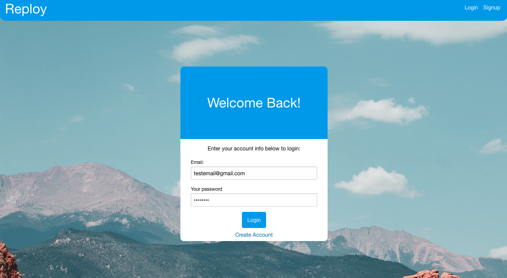
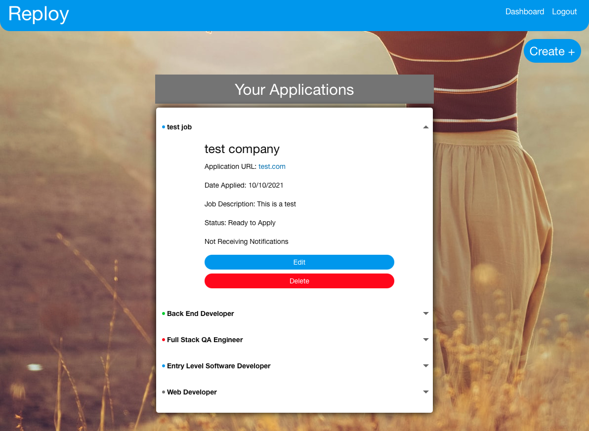

# Reploy - Job Application Tracker

    [](./LICENSE)
## Description

Live Website: https://reploy.herokuapp.com/

This project stores the users job applications in one easy to use location in order to make the job search less stressful. The website has a polished minimal look so the user can easily see what they need and move on with their job search. Reploy has a secure login system that encrypts the users password and stores the user's information in a database. Our notification system will allow the user to choose if they want to recieve emails about their job postings to ensure that they don't lose track of their applications.

## Table of Contents:
* [Installation](#installation)
* [Usage](#usage)
* [Screenshot](#screenshot)
* [Contributors](#Contributors)
* [Credits](#credits)


## Installation 

This project requires node.js to be installed on your local machine. 

```
$ git clone git@github.com:abjj1999/Job-Tracker.git
$ cd Job-Tracker
$ npm install
$ npm start
```
Visit localhost:3001 on any web browser.


## Usage 

This project should be used as a tool to streamline your job search.  This project allows you to spend more time searching for that dream job, and less time worrying about what jobs you have applied to and when to follow up with recruiters.    

## Screenshot





## Contributors:

- [Abdullah Al Hilfi](https://github.com/abjj1999)
- [Bailey Poe](https://github.com/bpoe1222)
- [J Isaias Torres](https://github.com/itorres60)
- [Zach Yarbrough](https://github.com/zachyarbrough)

## Credits

UT Austin full stack web development bootcamp